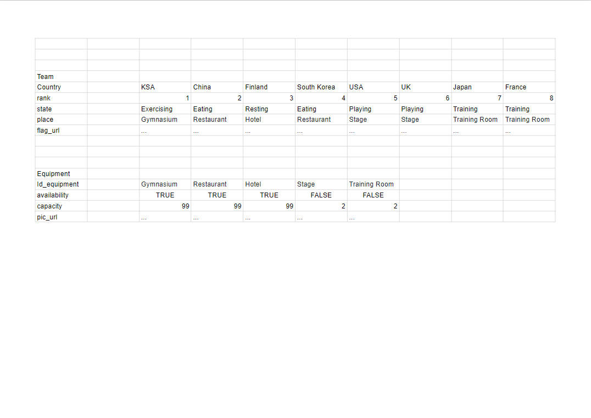

# OWWC_en_Django
 Autonomie pour info temps 2
 
（打开python虚拟环境）

PS D:\Web Development\OWWC\OWWC_en_Django> cd OWWC

PS D:\Web Development\OWWC\OWWC_en_Django\OWWC> .\Scripts\activate

（打开Django 服务器）

(OWWC) PS D:\Web Development\OWWC\OWWC_en_Django\OWWC> cd ..

(OWWC) PS D:\Web Development\OWWC\OWWC_en_Django> python manage.py runserver

 

 Restrictions:
 There must be 2 teams at training room and on the stage  
 Restaurant, gymnasium and hotel is always available for all the teams.

